# CoffeeShare - Arhitectura Sistemului

## Diagrama Arhitecturii Generale

```mermaid
graph TB
    subgraph "CLIENT LAYER"
        A["React Native Mobile App<br/>Expo SDK 53 + TypeScript<br/>Cross-platform iOS/Android"]
        B["Admin Web Dashboard<br/>React.js + Material-UI<br/>Real-time Management"]
    end

    subgraph "AUTHENTICATION & SECURITY"
        C["Firebase Authentication<br/>Email/Password + 2FA<br/>JWT Token Management"]
        D["SSL Certificate Pinning<br/>Certificate Validation<br/>HTTPS Enforcement"]
        E["Secure Local Storage<br/>expo-secure-store<br/>AES-256 Encryption"]
        F["Device Security Layer<br/>Jailbreak/Root Detection<br/>Integrity Validation"]
    end

    subgraph "BACKEND SERVICES - FIREBASE"
        G["Cloud Firestore Database<br/>NoSQL Document Store<br/>Real-time Synchronization"]
        H["Cloud Functions Runtime<br/>Server-side Logic<br/>Auto-scaling Infrastructure"]
        I["Firebase Cloud Storage<br/>Binary Asset Management<br/>Global CDN Distribution"]
        J["Firebase Analytics Engine<br/>User Behavior Tracking<br/>Custom Event Processing"]
    end

    subgraph "EXTERNAL API INTEGRATIONS"
        K["Google Maps Platform<br/>Geolocation Services<br/>Navigation & Routing"]
        L["Stripe Payment Gateway<br/>PCI DSS Compliant<br/>Multi-currency Support"]
        M["Sentry Error Tracking<br/>Performance Monitoring<br/>Real-time Alerting"]
    end

    subgraph "CORE APPLICATION FEATURES"
        N["QR Code Management<br/>Generation & Validation<br/>Time-based Token System"]
        O["Subscription Engine<br/>Coffee Lover Plans<br/>Bean Credit Tracking"]
        P["Analytics Dashboard<br/>Real-time Statistics<br/>Performance Metrics"]
        Q["Internationalization<br/>Multi-language Support<br/>Dynamic Localization"]
    end

    %% Client Layer Connections
    A -.->|"Secure Authentication"| C
    A -.->|"SSL Handshake"| D
    A -.->|"Local Data Cache"| E
    A -.->|"Security Validation"| F
    B -.->|"Admin Authentication"| C

    %% Security to Backend
    C ==>|"User Data Sync"| G
    D ==>|"Secure API Calls"| H
    E ==>|"Cache Synchronization"| G
    F ==>|"Security Validation"| H

    %% Backend Internal Communication
    G <-->|"Real-time Updates"| H
    H -->|"Asset Management"| I
    H -->|"Event Tracking"| J

    %% External API Integration
    A -.->|"Location Services"| K
    A -.->|"Payment Processing"| L
    A -.->|"Error Reporting"| M
    H ==>|"Payment Validation"| L

    %% Core Features Integration
    A ==>|"QR Code Operations"| N
    A ==>|"Subscription Management"| O
    A ==>|"Statistics Retrieval"| P
    A ==>|"Language Switching"| Q
    N ==>|"Token Validation"| H
    O ==>|"Data Persistence"| G
    P ==>|"Metrics Calculation"| G

    %% Professional Styling
    classDef clientStyle fill:#2E86AB,stroke:#1B5E7F,stroke-width:3px,color:#ffffff
    classDef securityStyle fill:#A23B72,stroke:#7A2B56,stroke-width:3px,color:#ffffff
    classDef backendStyle fill:#F18F01,stroke:#C4720D,stroke-width:3px,color:#ffffff
    classDef externalStyle fill:#C73E1D,stroke:#9A2F16,stroke-width:3px,color:#ffffff
    classDef coreStyle fill:#6A994E,stroke:#52753B,stroke-width:3px,color:#ffffff

    class A,B clientStyle
    class C,D,E,F securityStyle
    class G,H,I,J backendStyle
    class K,L,M externalStyle
    class N,O,P,Q coreStyle
```

## Instrucțiuni pentru export:

1. **Copiază tot conținutul acestui fișier**
2. **Creează un repository nou pe GitHub** (poate fi privat)
3. **Creează un fișier README.md** și lipește conținutul
4. **Commit & Push** - GitHub va renda automat diagrama
5. **Click dreapta pe diagramă** → "Save image as PNG"

Diagrama va fi renderată automat și va arăta profesional!
